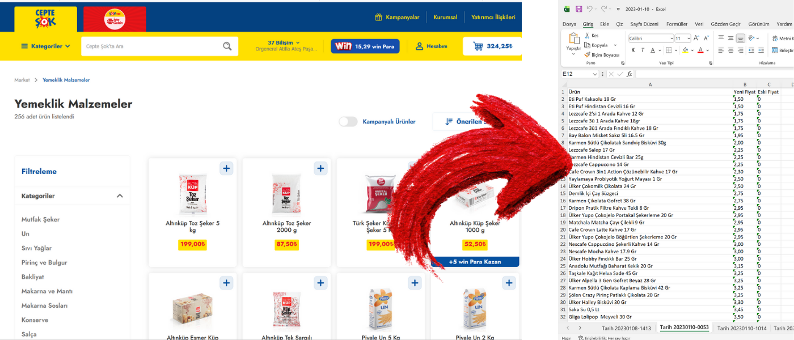

# Şok Market Otomatik Fiyat Çekme ve Kayıt Aracı



## Proje Tanımı
Bu proje, Şok Market'in web sitesinden ürün fiyatlarını otomatik olarak çekip, Excel dosyası olarak kaydeden bir Python uygulamasıdır. Selenium ve BeautifulSoup kullanılarak, istenen kategori sayfasındaki tüm ürünler hızlıca listelenir ve fiyatları kaydedilir.

## Özellikler
- Şok Market web sitesinden ürün ve fiyat bilgilerini otomatik toplar
- Tüm ürünleri kaydırarak yükler ve eksiksiz veri çeker
- Verileri Excel dosyası olarak kaydeder
- Kullanıcıdan URL alabilir veya varsayılan kategoriyle çalışır
- 2023, 2024, 2025 Şok market fiyatları Fiyat Arşivleri klasörü altında bulunmaktadır

## Kurulum
1. Python 3 ve pip yüklü olmalı.
2. Gerekli paketleri yükleyin:
   ```bash
   pip install selenium beautifulsoup4 openpyxl
   ```
3. Bilgisayarınızda Google Chrome kurulu olmalı.
4. ChromeDriver sürümünüz, Chrome ile uyumlu olmalı. [ChromeDriver indirme](https://chromedriver.chromium.org/downloads)
5. Uygulamayı çalıştırmak için:
   ```bash
   python sok.py
   ```

## Kullanım
- Çalıştırınca sizden bir Şok Market kategori URL’si ister. Örnek:  
  `https://www.sokmarket.com.tr/meyve-ve-sebze-c-20`
- Tüm ürünler ve fiyatlar otomatik olarak çekilir ve Excel dosyasına kaydedilir.

## Ekran Görüntüsü


## Video Anlatımlar
Aşağıdaki videolardan projenin nasıl çalıştığını izleyebilirsiniz:


- [YouTube Video 1: Şok Market Fiyat Çekme Tanıtım 1](https://www.youtube.com/watch?v=WPR_YN2UhSs)
- [YouTube Video 2: Şok Market Fiyat Çekme Tanıtım 2](https://www.youtube.com/watch?v=98G7pNYnS0Y)

## Katkı ve Lisans
Katkıda bulunmak isterseniz, lütfen bir pull request gönderin. Açık lisansdır istediğiniz gibi kullanıp dağıtabilirsiniz.
